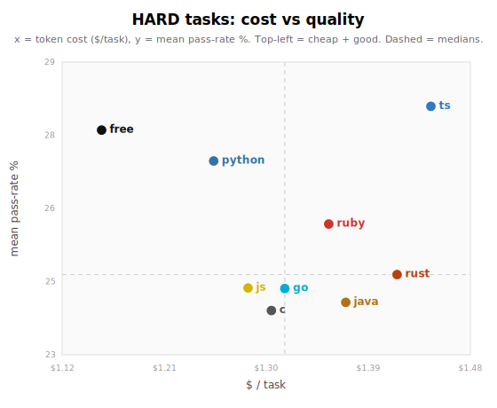
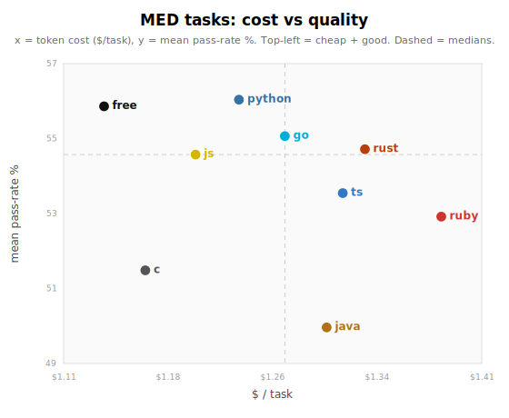
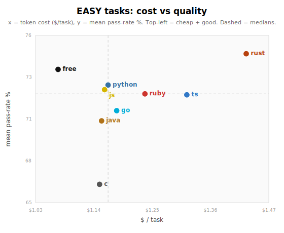

# A comprehensive evaluation of the best programming languages for agents

Here is an old programmer argument that never dies: which language is best.
We have agents now, so I ran a targeted, measurable version of it with hard data instead of just vibes.

This study uses **[ProgramBench](https://github.com/facebookresearch/programbench)** from Facebook Research ([repo](https://github.com/facebookresearch/programbench), [paper](https://arxiv.org/abs/2605.03546)).
The tasks, the sandboxing, and the scorer are theirs; my contribution is the experiment design layered on top: hold the model fixed and vary the language.

I took one model, gpt-5.5, held it fixed, and had it solve the same set of programming tasks eight separate times, once in each of eight mandated languages: C, Go, Rust, Java, JavaScript, TypeScript, Python, and Ruby.
Then a ninth arm, **free choice**, where the model picks the language itself per task.
Same model, same tasks, same sandbox, same scoring; the only variable is the language it was allowed to write in.

Four findings carry the post:

1. **Rust is the best easy-task language but has the steepest drop to the hard tasks.** It wins where the contract is crisp and falls into the low cluster where coverage is what is missing.
2. **TypeScript's type checker earns its keep on hard tasks.** TypeScript and JavaScript tie overall, but on the hardest tasks TypeScript pulls ahead: `tsc` catches a class of crash bugs (unguarded `undefined`, unhandled union cases, bad imports) that JavaScript ships straight to a runtime failure. The surprise is that this pays off even though the agent rarely writes strict types: baseline inference plus a mandatory compile gate do the work almost for free.
3. **The legacy systems languages, C and Java, are the two worst arms.** For agent work, I would steer away from them.
4. **Free choice is a good default.** It is marginally the best-scoring arm and the cheapest, and you do not have to think about it.

None of these is a blowout, and getting them to be trustworthy took two rounds of cleanup that are themselves part of the story, so let me lay out the setup first.

## Setup

The benchmark is [ProgramBench](https://github.com/facebookresearch/programbench): reverse-engineering tasks built from real open-source CLI tools.
Each task hands the agent the docs and observable behavior of a real tool (htop, jq, xsv, brotli, and so on) inside a sealed sandbox with no network, with the source and tests hidden, and asks it to reimplement the tool well enough to pass a large hidden test suite.
It is a good harness for this question because the task is "match this exact behavior," not "write idiomatic code," so the language is a real variable and not a style choice.

The model is held constant at **gpt-5.5** at the Codex CLI default reasoning effort across all nine arms.
This is not a model comparison; it is a language comparison with the model nailed down.

The nine arms: **codex-free** (model picks the language per task) and **codex-lang-{c, go, rust, java, js, ts, python, ruby}** (mandated).
Toolchains are normalized so nobody gets a head start: free-choice gets all eight toolchains; each mandated arm gets only its own.

### How I measure it

Every task produces a per-task pass rate: the fraction of that task's (non-ignored) hidden tests that passed.
I report two things.

1. **Mean pass rate, broken down by task difficulty** (easy / medium / hard), as the primary way to communicate the result.
2. **A threshold-free significance test** (paired Wilcoxon signed-rank, Holm-corrected) on the continuous per-task pass rate, for the "better / worse" claims.

I break the mean down by difficulty rather than reporting one pooled number because the tasks span a wide difficulty range, and a single mean weights every task equally, conflating "did well on trivial tasks" with "made progress on hard ones."
Difficulty is defined as the cross-arm mean pass rate on each task (low = hard), split into equal-count thirds.
I deliberately do not rank on a single solve-at-X% cutoff: the "winner" flips depending on where you put the bar (the score distributions cross), so no cutoff gives a stable ranking.

**Denominator: n = 192.**
I blocklist 8 tasks: 7 structurally broken (4 fill the disk and wedge the daemon; 3 produce identical failures across every arm regardless of submission) plus `dsq`, which can only be satisfied by delegating to a SQL engine bundled in the language runtime that no sandbox strip can remove (see Caveats).

## The results

All nine arms compiled at essentially 100%, so the spread is entirely in how much of each task got solved.
The clearest way to see it is cost versus quality at each difficulty level: each point is one language, x is token cost ($/task), y is mean test pass rate, and the ideal corner is top-left (cheap and high-quality). The dashed lines are the medians.

Three things to read off the panels.
First, the quality axis is a **tight cluster**: at every difficulty the top six or seven languages sit within a few points, and the paired significance test cannot separate free choice from rust, python, go, ts, or ruby.
The clear signal is at the *bottom*: free choice is statistically ahead of only c and java, and **c and java are the two worst arms** (low on every panel; c is also the worst on easy tasks).
Second, watch **rust** move across the panels: on easy tasks it is tied for the best quality but sits far to the right (most expensive), and on hard tasks it slides down and right (costly and weak), while free, python, and ts hold the top.
Third, **free choice is the only arm in the cheap-and-good corner of all three panels** at once, which is also why it is marginally the highest-scoring arm overall and the cheapest.
The rest of the post is why each of these happens.

## Rust: best on easy, steepest drop on hard

This is the cleanest finding in the study.
Rust is the **best easy-task arm** (74.7) and falls into the **low cluster on hard tasks** (24.7), with the steepest easy-to-hard drop of any language.

**Why it wins the easy tasks: it reproduces the exact contract.**
Almost every easy tool in this set is itself a Rust/clap CLI, so the hidden tests encode clap's precise behavior, and Rust matches it where scripting languages only approximate the happy path.
The mechanism shows up test-by-test.
On hex (a hex dumper) Rust scored 87.5% to Python's 67.7%, and the entire gap is one root cause: **attached short flags.**
Python's parser only matched `-a` as a whole token, so `hx -ar file` (array output) was rejected with `error: unexpected argument '-ar'`; Rust's clap parser splits `-a` + value `r` exactly like the original, and ~200 tests flip on that alone.
On sd (a sed-like tool) Rust scored 91.6% to C's 77.2% by pulling in the real `regex` crate, matching the original's Rust-regex semantics (lazy matching, negated classes, "backreference not supported") where C hand-rolled regex and diverged.
Its own framing on sd:

> "this is a clean reimplementation. I'll use Rust with `clap` and `regex` from the offline vendor tree, matching the core `sd 1.0.0` behavior and enough formatting/error surface for tests."

That is exactly the edge that wins a fully-specified task: compiled, typed exactness on flags, error strings, and exit codes, where a scripting language lands in the 55-70% band.

**Why the lead doesn't hold on hard tasks: its one advantage doesn't transfer.**
The important nuance, because it is easy to overclaim here: Rust is *not* uniquely bad on hard tasks.
It scores 24.7 there, in the low cluster with most arms, and go (24.4), js (24.4), java (24.0), and c (23.9) are all at or below it.
On a hard task the substance is a domain engine (an image decoder, a query language, a JavaScript interpreter), the bottleneck is **coverage**, and no arm's offline, network-free sandbox ships the library that would supply it, so the from-scratch arms all sink together.
Rust names the ceiling out loud on chafa (image-to-ANSI):

> "The vendored Rust crates don't include image decoders, so a full renderer is not practical here. I'm building a self-contained compatibility shim."

But every other language hits the same wall: on quickjs, a whole JavaScript interpreter, the from-scratch arms all cratered (rust 3%, c 4%, go 4%, java 5%), and only the arms that could lean on the host JavaScript runtime survived (~60%).
The codec and engine tasks floor for *everyone* (see Caveats), so the hard-task weakness is shared, not a Rust trait.

What *is* Rust-specific is the **drop**: it has the steepest easy-to-hard fall of any arm, about 50 points.
Its edge, compiled and typed exactness, is a difficulty-specific advantage: it turns a crisp, fully-specified spec into a near-perfect score, and it turns a coverage problem into nothing.
So Rust had the most to lose, precisely because the single thing it is best at is the thing that does not carry to hard tasks.

**And it pays the most to do it.**
Rust runs more build cycles than any arm (it pays a full `cargo build --release` on every fix, where a scripting arm re-runs the interpreter for free), and it is the **most expensive arm overall** and among the priciest on hard tasks ($1.42/task).
On sqlite it ran 15 compile invocations to free's 3; it also hit Rust-specific friction (`clap_derive` was not vendored, forcing a mid-task parser rewrite on multiple tasks; `ring` "is building from vendored source, so this first pass takes a little longer").
It spends the most exactly where the spend converts the least.

Honest caveat on strength: the rust-versus-free crossover is **directional but not significant** (free beats rust ~3.3 points on hard and is about a point behind on easy; interaction p ≈ 0.09).
Part of the raw gap came from free wrapping several hard tasks rather than reimplementing them, which I stripped out and re-ran (see Caveats), so the de-polluted gap quoted here is the conservative one.
The direction is real and matches the charts; I would not bet the farm on the magnitude.

## TypeScript edges JavaScript on hard tasks, and it really is the type checker

The TypeScript-versus-JavaScript pair is a controlled experiment hiding inside this study: same model, same tasks, same sandbox, and both arms compile down to JavaScript run by the same Node.
The only structural difference is that the TypeScript arm has to clear `tsc` before it can run.

**Overall they tie.**
TypeScript scored 51.4 to JavaScript's 50.2, a +1.2 gap that is not significant (paired Wilcoxon p = 0.65), and the two split individual tasks nearly evenly (TypeScript wins 98, JavaScript 92).
But the tie hides a split by difficulty.
On the hardest third of tasks TypeScript beats JavaScript by +4.1 (28.5 versus 24.4), winning 25 of those tasks and losing 13.
TypeScript wins fewer tasks but by larger margins, and the margins land where a program can crash outright.

**What `tsc` catches are real type errors.**
On angle-grinder (a log query tool, 43.0 versus 27.3) `tsc` inferred the token reader `eat()` as `string | undefined` and rejected calling `.toLowerCase()` on it (`error TS2339: Property 'toLowerCase' does not exist on type 'string | undefined'`), forcing the agent to add an `if (x === undefined) return` guard; the JavaScript version has no such guard and throws `TypeError: Cannot read properties of undefined` the moment the parser runs off the end of its input.
On cppcheck (17.5 versus 3.2) the argument parser returns `Options | string`, a string on bad input, and `tsc` would not let the agent read fields off the result until it handled the error case (`if (typeof parsed === "string") { ...; process.exit(1) }`); the same build also caught an accidentally duplicate-pasted source file (36 `TS2393: Duplicate function implementation` errors) that the agent then deleted.
On dropbear (an SSH client, 64.2 versus 32.2) the JavaScript submission ships a program that crashes at startup: 243 of its results are hard `error`s (Node `MODULE_NOT_FOUND` on its own entrypoint, and a daemon that never prints its readiness banner), against 54 for TypeScript, whose checked-and-built pipeline produced a runnable artifact.
These are exactly the unguarded-`undefined`, unhandled-union, broken-import crashes that types are supposed to stop, and on the hard tercile they stop them.

**The surprise is that the agent gets this almost for free, not by typing carefully.**
Only 28% of TypeScript submissions enabled `strict`, 92% used `any` at least once (median 5 uses, up to 103), and `noUncheckedIndexedAccess` was on in zero of 200; the hard-task winners are no more typed than the rest, and angle-grinder itself carries 44 separate `any`s.
The catches above came from `tsc`'s _default_ inference (it derives `string | undefined` from control flow with no annotation) plus a mandatory gate: TypeScript's `compile.sh` runs `tsc` under `set -e` and refuses to emit `./executable` until the program type-checks, where JavaScript's `compile.sh` is just `cat > executable` and ships whatever was written.
The agent treats TypeScript as JavaScript-with-a-checker, and the checker still pays off.
When the agent does fight the gate, it wins: the type system erases at runtime, so it caught no more deep bugs than it was forced to, and TypeScript still threw runtime `TypeError`s in _more_ tasks than JavaScript (46 vs 44).
On pastel a TypeScript submission crashed with `TypeError: Cannot read properties of undefined (reading 'r')` in its compiled output because `stops[seg]` indexed past the array, exactly as untyped JavaScript would, since `noUncheckedIndexedAccess` was off and the type was gone by then.

**It is a narrow, shallow edge, and the limits matter.**
It is a tie overall; the checker only moves the needle on the subset of hard tasks where an unguarded crash would otherwise tank the whole score.
It is partly confounded by sheer volume: on cppcheck and angle-grinder the TypeScript submission is also two to three times as much code, so "TypeScript implemented more" rides along with "TypeScript crashed less."
The gate is gameable: on run the agent cleared a fall-through error by loosening a function's return type from `never` to `void` rather than fixing the logic.
And it does nothing for the output-format and semantic correctness that most hard tasks actually hinge on: on scc, where both arms compiled cleanly and shipped 475-line implementations, JavaScript still won (132 tests to 62) by matching the exact output format better.
The largest single TypeScript win, gittype (48.4 versus 13.8), is pure feature completeness with zero typing involved: the JavaScript version simply never implemented `--option=value` syntax or the `cache` subcommand.

So the finding is honest and bounded: **on hard tasks, `tsc`'s baseline type checking plus a mandatory compile gate buy a small but real edge by catching crash-class bugs the JavaScript arm ships to runtime** - and they do it almost for free, in spite of the agent's loose typing, not because of disciplined types.
It is shallow crash-prevention, not deep correctness, and it is a wash everywhere but the hard tercile.
The broader static-versus-dynamic split across all eight mandated arms is also a wash: this is the setting least favorable to types (black-box CLI matching never exercises a library's type contract across a codebase), so read it as "the checker helped a little here," not "static types are decisive."

## C and Java: the two worst arms, and I would avoid them for agents

C (47.4) and Java (48.0) are the bottom two arms, and the only two arms significantly below free choice (paired Wilcoxon, Holm-corrected: c p < 0.0001, java p = 0.0001; every other arm is statistically tied with free).
One sentence covers both: they pass the algorithmic core but bleed out on the long tail of CLI-contract details (flag aliases, value handling, error strings, output completeness), and they get no library leverage on the easy JSON/HTTP/regex tasks where the dynamic languages just import a crate.

**C is a high-variance specialist that loses the median.**
When the task is native systems C, it is spectacular: cmatrix (a terminal animation) 97.8% by emitting the raw ANSI stream directly, and htop 94% by reading `/proc/[pid]/stat` itself, no abstraction tax.
But it is **last on every difficulty tercile**, because the median task makes C hand-roll the infrastructure every other language imports, and each reinvention drops a contract.
On the httpie clone, C opened a raw socket to port 443 but sent plaintext HTTP (no TLS library), so every HTTPS test got the server's own `400 The plain HTTP request was sent to HTTPS port` and it scored 47.6% to JavaScript's 70.2%.
On nomino (a regex renamer) it hand-translated the original's named groups into POSIX `regexec` and hand-wrote a JSON map scanner, scored 41.1% (lowest of all nine arms), and failed on the regex-semantics mismatch.
On grex it _parsed_ `-x`/`-c` into its options struct but never implemented them, so the verbose/colorize tests found bare output.
It is even last on _easy_ tasks (66.4), because the easy tercile is full of JSON, HTTP, and text CLIs that are exactly the missing-batteries tax; and it loses the CLI-contract tail even on its home turf (on xz the codec is byte-perfect, but `--badflag` returns 0 instead of erroring, because stock `getopt_long` gives none of those per-option validations for free).

**Java's problem is the contract tail plus JVM idioms.**
With the timeout artifact removed (it is one of the two fixes noted under Caveats), Java's low placement is genuine wrong-output, not measurement, concentrated in CLI-flag and TUI tasks.
On htop (58.6% to C's 94% on the same task) it wired up every short flag to consume its next token except `-u`, which read `$USER` and ignored the argument, so `-u root` fell through to `invalid option -- 'root'`.
On entr it printed help to stderr (failing `assert b'summary:' in stdout`) and used a JVM shutdown hook for cleanup, so Ctrl-C produced exit code 130 where the test wanted 0 or 2.
On hwatch it only built the interactive TUI path, so the `--stdout` batch tests got empty output.
The throughline is Java's verbose stdlib and JVM conventions: more boilerplate per feature means fewer of the small contracts land, and idioms like shutdown-hooks-to-exit-codes and stderr-default-help actively violate the native CLI behavior the tests encode.

Neither is a disaster on any single task, but both reliably leave points on the floor relative to a scripting language or Rust, at no cost advantage.
For agent-written, behavior-matching work, I would reach for almost anything else.

## Free choice is a good default

Free choice is the highest-scoring arm (52.4) and the cheapest ($1.12/task), and it sits in the cheap-and-good corner of all three quadrant charts.

**The picking is a smart default with two well-reasoned exceptions.**
It chooses **Python on ~80% of tasks**, switches to **C for native/perf tools** ("I'm checking the container's installed headers and libraries before choosing C vs another language" on brotli), and to **Go for Go-ecosystem tools** (every Go-linter task, because the tool analyzes Go code: "the program is errcheck-like, a Go static analyzer; I'm creating throwaway Go packages to compare diagnostics").
It even picks JavaScript when the tool _is_ a JS engine ("use the installed Node runtime as the ECMAScript engine" on quickjs).
The picks are legible and adaptive.

**Why it is cheapest: no compile-fix loop.**
On the 152 tasks where it picked Python, free averaged 41 turns and $1.15, versus rust at 45 turns / $1.42 and TypeScript at 43 turns / $1.38 on the same tasks, at statistically equal quality.
The driver is build cycles: per task, rust averages 3.2 failed commands and 2.2 builds, TypeScript 3.2 failed and 3.8 builds, free 1.9 failed and 0.5 builds.
On html-to-markdown, free (Python) used 18 commands, 0 builds, 0 non-zero exits; rust used 42 commands, 7 `cargo` invocations, 4 failures (burning turns on `error[E0382]: borrow of moved value`); TypeScript used 33 commands, 3 builds, 5 failures (`error TS2300: Duplicate identifier`).
Python has no compile step, so those turns simply do not exist.
That is why free is cheapest at _every_ difficulty, even hard ($1.15).

**Why it is a good default: it rarely collapses.**
Python reliably gets _something_ working, so free has one of the lowest near-zero rates of any arm, and it picks up partial credit broadly where a mandated compiled language craters: 63% on quickjs where every compiled arm scored ~4%, and 74% on gron where mandated Java scored 0%.

The honest limit: free wins by beating the _average_ forced language (+2.3), not the best.
An oracle picking the ideal language per task would score 59.3, about 7 points above free, and free does make real mispicks: on gowsdl it reasoned "I'm going to implement a small WSDL parser in Python, which is a better fit here," scored 15%, and the mandated Go arm scored 72% because the tool emits Go source.
But that is the whole point: **you cannot reliably beat free choice by mandating a language without already knowing the answer, and even gpt-5.5 cannot call it in advance.**
Letting the model choose gets you the top of the cluster, at the lowest cost, with zero configuration: a good default.
(One caveat: some of free's edge on hard tasks came from wrapping the reference tool rather than reimplementing it; with that stripped out and re-run, its lead is marginal and it is not uniquely robust on hard tasks. What stands is: marginally best, cheapest, and a sensible no-think default.)

## Caveats that still exist

Before computing any of these numbers I fixed two measurement artifacts.
First, a per-test process-startup timeout was scoring slow-starting tests as zero (it had put Java in a false last place); I re-scored everything at a 6-hour timeout to remove it.
Second, our sandbox leaked the reference tool (its binary, shared libraries, and source), so some arms passed by wrapping the real tool instead of reimplementing it. I code-read every at-risk task across all nine arms, stripped the reference and re-ran each wrapping cell (and strengthened the prompt to forbid stdlib/runtime engines too, like Node's built-in brotli or Python's `sqlite3`), then re-audited until zero working wraps remained. One task, `dsq`, can only run its queries through a SQL engine bundled in the language runtime that no strip can remove, so it is blocklisted (the 8th excluded task).
Every number in this post is on that de-polluted, timeout-corrected data.
Those two are fixed; the caveats below are the ones that remain, and they bound how hard you should lean on the numbers.

**A class of tasks measures library-discovery, not language capability.**
The codecs and engines, brotli, sqlite, lz4, ffmpeg, chafa, ctags, are effectively impossible to reimplement from scratch in one session, so de-polluted they floor to near-zero for _every_ arm; the two with a large argument/format surface (zstd, xz) reach the 30-60 band on flag and format handling but still never implement the actual codec.
gpt-5.5 never once reimplemented a compression codec or database engine in any language; it always reached for the library or a runtime-bundled one (which is exactly the wrapping we stripped, and why `dsq` is blocklisted).
These tasks land in the hard tercile and add floor-noise there; they do not discriminate between languages, they discriminate "did you find the engine."
The one exception is blake3, which is genuinely reimplementable (it held at ~85% across arms when forced).

**Per-task scores carry agent run-variance.**
Re-running the same agent on the same task produces a different submission; on a single task the score can move 10-15 points just from that.
The de-polluted cells are one fresh sample each, so small per-arm wiggles (a point or two) are noise, not signal; only the larger, consistent gaps should be read.

**Difficulty is defined by the arms under study.**
"Hard" means "this panel of arms scored low," which is endogenous.
I use a leave-one-out difficulty for per-arm claims so an arm cannot inflate its own bin, but the panel-level circularity remains; an external difficulty proxy (test count, lines of code) would be cleaner.

**Small sample for group comparisons.**
Eight mandated languages is a thin sample for the static-versus-dynamic split, so treat that as "no signal," not a measured null.

## Dig in yourself

The data sits next to this post under `data/`, and every quote here is verbatim from a real trajectory.
`data/per-task.csv` has the per-task pass rate, cost, and chosen language for all nine arms, and `data/submissions/` has the code gpt-5.5 actually wrote for every task in every language: the same tool, reimplemented nine ways.
Every table and chart in this post is recomputable from that CSV; `DATA.md` documents the columns and the steps.
n = 192 tasks per arm, nine arms, one model, on de-polluted data (reference engine stripped, timeout artifact removed).
The part I would most like a second pair of eyes on is the de-pollution: the strip scripts and the re-run path live in the harness (`DATA.md` points to them), so if you re-strip and re-run and the rankings shift, I want to see it.
(The raw per-test eval JSON and full transcripts are too large to ship in the repo; they are available on request.)
