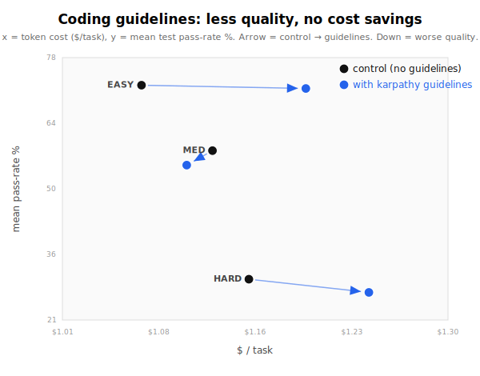

# Do "reduce LLM coding mistakes" guidelines help a coding agent? I measured it. (No.)

*Written as a Twitter/X thread. Each numbered block is one tweet.*

---

**1/** There's a popular `CLAUDE.md` going around: "behavioral guidelines to reduce common LLM coding mistakes" - Think Before Coding, Simplicity First, Surgical Changes, Goal-Driven Execution.

I A/B tested it on a real coding agent. Same model, same 192 tasks, the guidelines were the only thing that changed.

It didn't help. It slightly hurt. 🧵

**2/** Setup: gpt-5.5 reverse-engineers a CLI tool from its compiled binary + docs, graded by a hidden test suite (ProgramBench). Two arms, identical except one gets the guidelines (injected the way the file is meant to be used). Matched pairs, n=192.

**3/** Headline: mean test pass-rate **53.7% → 51.5%**.

−2.2 points, and it's statistically significant (paired Wilcoxon p=0.005). It lost 111 of 192 tasks and won 79. And it didn't save money either (~+5% cost).

**4/** One honest nuance: it edged *up* on fully-solved tasks (solve@75: 13.5 → 15.6). So it cleanly nails a few more, while scoring lower on average. It wins the "finished" count and loses the mean - the two metrics genuinely disagree.

**5/** Where does it lose? On tasks with real substance: hard −2.9, medium −3.1. Easy tasks are basically flat (−0.7). The guidelines don't hurt when there's nothing to leave out.

**6/** Why? "Simplicity First" ("minimum code", "no features beyond what was asked") makes it build a **narrower** tool. Straight from its own logs:

- *"a compact custom evaluator... without trying to become a database"*
- *"...instead of delegating to SQLite"*

It reasons itself out of completeness.

**7/** The twist: in most regressions it wrote **more** code, not less. So it's not "fewer lines" - it's narrower *scope and fidelity*. It even refused to delegate to a real bundled engine (sqlite, bash, brotli) when that was the simplest *correct* move.

**8/** What it's NOT: not wasted turns (turn count was flat), not cheating (I audited every suspicious win - zero reference-tool wrapping). The guidelines genuinely changed *what it built*, for the worse.

**9/** Caveat: one model, one guideline file, one task type (black-box CLI reverse-engineering). With no spec to read, "write the minimum" quietly drops the edge cases the hidden tests check. Small effect, but real and significant.

**10/** Takeaway: guidelines tuned to make a model *terser and safer* can cost **completeness** on spec-faithful work. "The simplest thing that passes my own mental model" is not "the thing the hidden tests actually check."

Measure before you adopt a vibe. Full data + the code each arm wrote is in the repo under this post's `data/`.
