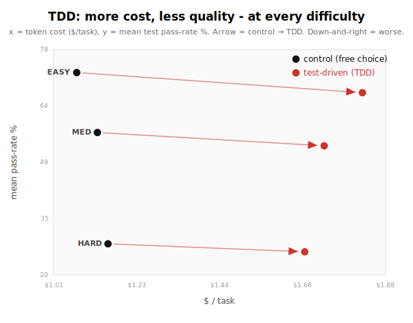

# Does test-driven development help a coding agent? I measured it. (No.)

I took one model, gpt-5.5, and had it solve the same set of programming tasks twice.
Once with free rein, and once with a mandated test-driven-development workflow: write a failing test first, write the minimum code to pass it, repeat.
TDD is gospel for human engineers, so I expected it to help, or at worst be neutral.

It was neither.
The TDD agent scored **lower on quality and cost 55% more**, on the same tasks, with the same model.
It is the rare result where one option is worse on every axis at once.

## How I measured it

The tasks are ProgramBench: reverse-engineer a CLI tool from its compiled binary and docs, scored by a hidden test suite.
Two arms, identical except for the workflow: `control` (free choice of approach) and `tdd` (the test-first skill).
n = 192 tasks, on de-polluted data (a handful of tasks where the agent reused the reference tool's own engine were stripped and re-run, or dropped when that was unavoidable; see Caveats).

The headline metric is **mean test pass-rate**, with a **paired Wilcoxon signed-rank test** for the "better/worse" claim (every task is matched across the two arms, so the test differences out the task itself).
Cost is real token cost per task; both are confirmatory, fixed before I looked at results.
I break quality down by task difficulty (easy/medium/hard, defined by how the *other* eight language arms scored each task, so both of these arms are out-of-sample).

## The result: strictly dominated

Every arrow points the wrong way.
At every difficulty, the TDD arm is **down** (lower quality) and **to the right** (higher cost) of the control arm.

| | control | tdd | Δ |
| --- | ---: | ---: | ---: |
| mean pass-rate % | 52.4 | 48.8 | **−3.6** (Wilcoxon p < 0.0001) |
| tasks won / lost / tied | - | - | 53 / **136** / 3 |
| $ / task | $1.12 | **$1.73** | **+55%** |
| turns | 40 | 67 | **+69%** |

The −3.6 is significant and consistent (it also shows up in solve@75, 13.5 → 9.9).
TDD lost 136 of 192 tasks outright.
And it did so while spending 55% more money and taking 69% more turns.
More effort, worse result.

The extra spend is not bigger programs.
Output tokens rose only ~26%; **input tokens more than doubled (+112%) and the model's reasoning turns nearly tripled (+248%)**.
That is the red-green-refactor ceremony: each micro-cycle (write a test, run it, narrate the failure, implement, run again, narrate the pass, sync into the sandbox, re-run) is a separate turn that re-bills the entire context. The money buys process, not product.

## Why it hurts: a self-written test can't see a hidden spec

The failure mode is specific and, in hindsight, obvious.
On a reverse-engineering task the real specification is **hidden** inside the grader's test suite.
The agent can only write tests for the behavior it managed to *observe* from the binary.
So it writes tests for the surface it can see, implements just enough to turn them green, watches its own tests pass, and **confidently stops** - while the hidden grader exercises behavior it never thought to test.
"Write the minimum code to pass" turns into "ship a narrower clone."

You can see it in the code: in nearly every regression the TDD *implementation is smaller* despite costing 2-3x more.

- **json-tui** (82 → 46): both arms probed the same observable surface (help, version, keybindings, parse errors). The control arm then built a real interactive renderer (`termios` raw mode, `select`, `pty`). The TDD arm ran red-green cycles on the things you *can* unit-test - help text, the keybinding table, an off-by-one in an error column - and shipped an implementation that had **dropped `termios`, `select`, and the live TUI loop entirely**. You can't easily write a unit test for an interactive terminal, so under "no code without a failing test," it never built one.
- **eureka** (67 → 38, an *easy* task): the control arm shipped a 5.8 KB clone in one pass. The TDD arm wrote **13.7 KB of tests against 4.7 KB of implementation** - more test code than program - and the "minimal to pass" rule made it actively delete behavior ("I'm removing the setup validation").
- **csview** ($0.91 → $3.00, quality flat at ~92): the purest illustration. 53 narrated turns of write-test/run/sync cycles, much of it debugging problems the TDD setup itself created ("unittest did not discover pytest-style functions, so it was not a meaningful red test"; "nested `src/src` directories from repeated copies"). Triple the cost, for nothing.

It is **worst on easy tasks** (−5.3, and +69% cost) for the same reason: when the task is trivial, test-first is pure overhead.
The control arm just solves it; the TDD arm gold-plates a test harness around it first.

## The handful of wins are side-effects, not vindication

TDD did win a few tasks, and I want to be fair about them.
The biggest, `gowsdl` (15 → 68), improved because the red-green loop pushed the agent to generate reference outputs for *more* of the bundled sample files and lock each one - but that benefit comes from "iterate against more reference samples," which any disciplined diff-against-the-binary loop would give you, not from writing tests *first*.
The next, `gittype` (13 → 51), is mostly single-sample noise: the TDD implementation is actually smaller, and the control run shipped with a known parse bug.
Neither is evidence that test-first is the active ingredient.

## Caveats

This is a real, significant result, but it is narrow, and I do not want it over-read.

- **It is one model, one TDD skill, one kind of task.** This is gpt-5.5, a deliberately strict test-first skill, on *black-box CLI reverse-engineering*. The mechanism - self-written tests can't see a hidden spec, and "minimal to pass" suppresses breadth - is specific to that setting. TDD's usual payoff (a *known* spec, regression safety across a long-lived codebase) is exactly what these one-shot, hidden-spec tasks remove. **Do not read this as "TDD hurts coding."** Read it as "test-first is the wrong tool when you cannot see the specification."
- **The aggregate is solid; individual tasks are single samples.** The −3.6 / p < 0.0001 / 136-of-192 result is robust, but there are no per-task repeats, so individual deltas (especially the wins) carry variance. Lean on the aggregate and the mechanism; the per-task examples are illustrations, not proof.
- **Some of the cost is self-inflicted harness friction** (pytest-vs-unittest discovery, duplicated directories, probes hanging on interactive prompts). A cleaner setup would shave some spend - but not the core quality loss, which is the over-fit-and-stop dynamic.
- **It is not a budget artifact.** Every TDD run finished normally and declared itself done with its own tests green. The problem is premature confidence from passing self-written tests, not running out of turns. More budget would not fix it.

## Dig in yourself

The data sits next to this post under `data/`.
`data/per-task.csv` has the per-task pass rate, cost, and turns for both arms (plus the eight language arms used to define difficulty), and `data/submissions/` has the code the agent actually wrote in each arm for every task - so you can read, side by side, the control implementation and the thinner test-first clone of the same tool.
`DATA.md` documents the columns, the n = 192 blocklist, and how to recompute every number here.
