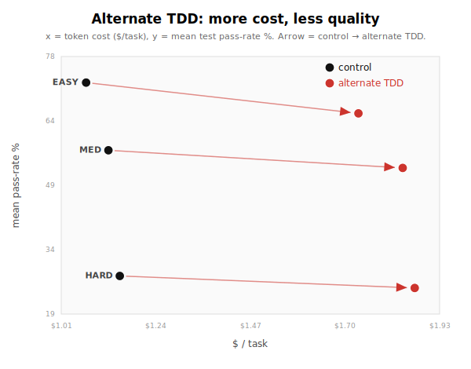

# Independent reproduction: another TDD skill

Will Hampson (@Whamp) ran the same ProgramBench comparison with a different TDD prompt: his behavior-focused, vertical-slice TDD skill. The run used the same `gpt-5.5` Codex setup and the same n = 192 blocklisted denominator.

The result points the same way as the original post. The alternate TDD skill did not beat the free-choice control, and it was statistically indistinguishable from the original TDD arm.

## Headline comparison

| arm | mean % | solve@75 | solve@60 | $ / task | turns |
| --- | ---: | ---: | ---: | ---: | ---: |
| control (`codex-free`) | 52.4 | 13.5 | 47.4 | $1.12 | 39.8 |
| original TDD (`codex-free-tdd`) | 48.8 | 9.9 | 32.8 | $1.73 | 67.0 |
| alternate TDD (`codex-free-tdd-will`) | 47.8 | 8.3 | 33.3 | $1.81 | 69.3 |

Paired tests on per-task pass rate:

| comparison | Δ mean % | wins / losses / ties | Wilcoxon p |
| --- | ---: | ---: | ---: |
| alternate TDD − control | -4.6 | 67 / 124 / 1 | 1.2e-06 |
| alternate TDD − original TDD | -1.0 | 93 / 95 / 4 | 0.74 |

## Difficulty breakdown

Difficulty is the same out-of-sample tercile split used in the original post: each task is ranked by the mean score of the eight mandated-language arms.

| difficulty | control % | control $ | original TDD % | original TDD $ | alternate TDD % | alternate TDD $ |
| --- | ---: | ---: | ---: | ---: | ---: | ---: |
| Easy | 72.5 | $1.07 | 67.2 | $1.82 | 65.4 | $1.73 |
| Medium | 56.9 | $1.13 | 53.4 | $1.72 | 52.8 | $1.84 |
| Hard | 27.9 | $1.15 | 25.9 | $1.67 | 25.2 | $1.87 |

## Interpretation

This is a failed disproof, not a new universal law. The alternate TDD skill was meant to be a stronger version of the workflow: behavior tests, public interfaces, one red-green-refactor cycle at a time, and no bulk test-writing. It still trailed the control arm by 4.6 mean pass-rate points and cost 62% more.

Against the original TDD arm, the alternate skill was basically tied: −1.0 mean pass-rate points, 93 wins, 95 losses, 4 ties, Wilcoxon p = 0.74. It spent slightly more per task.

The narrow conclusion is the same as the original post: on one-shot, hidden-spec ProgramBench CLI reconstruction, test-first workflow did not help this model. It made the agent spend more process on tests it wrote itself, while the hidden grader still rewarded behavior the self-written tests missed.

## Data

The per-task rows are in `data/per-task.csv` under arm `codex-free-tdd-will`. The submitted code is in `data/submissions/codex-free-tdd-will/`.
